# Software factory

A reference design for agentic software delivery behind mechanical gates. A person turns a
finding into a ticket with numbered observable examples. Agents build to it, run the
verification net and a cross-vendor review before a pull request exists, and open the PR. A
person reads the evidence, merges, and presses release.

Three human decisions stay on the line by design: the ticket is Ready, the PR is merged, the
release goes out. Nothing here removes them. What the design removes is the reading of diffs
between those decisions, by moving that work onto gates that refuse with a file, a line and a
reason. Lights-out for a qualified class of change is the last rung of a ladder
([11-scaling](docs/11-scaling.md), [adr/0006](adr/0006-pr-gated-output-human-release.md)), not
the measured state of the line: today every code merge is a named human's click, and the ledger
records who.

The design was derived from running the loop on a real product (kvart, an apartment association
management SaaS with money paths and a 4-locale UI) and from bootstrapping the same loop onto a
legacy Java core of 75 modules inside a group of companies. Every mechanism here was either
measured in one of those two places or is labelled as designed or proposed. `STATUS.md` is the
ledger.

## The claim in one paragraph

An agent generates code faster than people can read it. So the review load has to move off
people and onto gates, and gates have to be mechanical wherever they can be (ratchets that
only tighten, architecture diffs, coverage of changed lines, egress allowlists) and
inferential only where they must be (a cross-vendor reviewer that never saw the author's
context). What compounds is not the model, it is the verification net, the team knowledge
plane and the gates: every feature that lands makes the next one cheaper and safer. That is
the flywheel. The humans that remain do three things: approve intent, accept behaviour on
evidence, and press release.

## Before the code: the PM surface

The loop starts before any agent touches code, and that stage is the least automated part of
the factory. A PM works in a local workspace repository created from a template, next to
read-only clones of the specs and the code. A catalogue of skills reads the specs before the
code and never writes outside the workspace. One gated path leads out of it into the team
layer. [14-pm-surface](docs/14-pm-surface.md) is the full document; the mechanisms, with their
evidence class from `STATUS.md`:

| Mechanism | What it produces | Skill | Class |
|---|---|---|---|
| Intake | facts, decisions and open questions from a page, an issue, a memo or a document, cross-referenced against what the workspace already holds | `ingest` | `designed` |
| Ticket drafting | a story or epic under the tickets folder; type, project, epic parent, labels and links deduced from the source, the code and `TRACKER.md`, each shown with its reason, saved on approval, never pushed to the tracker | `ticket` | `measured` |
| Readiness | a score out of 100 against seven criteria, per-criterion gaps, one highest-impact question; 85 is Ready | `readiness-evaluator` | `measured` (kvart cycles self-scored 94 and 93 of 100 `[measured 2026-09-07]`) |
| Refinement | one question at a time until the score clears 85, then a drift check against the original and a session log | `task-improver` | `designed` |
| Splitting | a ticket over about two person-days becomes an epic with independently deliverable stories, coverage checked | `task-splitter` | `designed` |
| Graduation | a rewritten features file plus a handoff package; six checks, no partial packages; the human submits | `graduate` | `designed` |
| Specs from code | feature maps, a candidate table and spec pairs retro-generated on Day 1 and again when a ticket touches unbuilt surface; a sister spec delta after every behaviour-changing merge | `retrogenerate-specs`, `update-specs-for-commits`, `check-specs` | `measured` (run by hand on kvart) |
| Program design note | for a sized ticket, the shape of the change before the plan: which module gains what, where the transaction boundary sits, which slice lands first; the module list is the spillover scope for the architecture diff | [templates/program-design.md](templates/program-design.md), [adr/0010](adr/0010-program-design-before-the-plan.md) | `proposed` (the cycle-4 API contract is the measured precursor) |
| Spec as a gate input | the committed spec plus the ticket's numbered examples go to the reviewer, so scope drift is a finding with its own disposition | [adr/0009](adr/0009-the-spec-is-a-gate-input.md) | `proposed` |

Where these live in this repository:

- [templates/skills/](templates/skills/): 11 skills in the shape a Claude Code project consumes
  them, one directory each, anonymised from the reference implementation. Copy a directory into
  a workspace's or a repository's `.claude/skills/`.
- [deploy/marketplace/](deploy/README.md): the same skills as installable plugins, verbatim at
  pinned commits from the group's catalog. `pm-workspace` carries the seven PM skills including
  workspace setup; `spec-repos` carries the three spec skills; six more plugins cover rule packs,
  secret guarding, team memory, browser QA, a hygiene pass and a one-model fallback review.
- [templates/ticket.md](templates/ticket.md), [templates/pm-skill.md](templates/pm-skill.md):
  the ticket shape the skills produce and the skeleton every PM skill follows.

Two rules give the surface its shape. The specs and code clones are read-only: the agent never
commits, pushes or opens a PR against them, and the graduate package is the only way out. The
tracker is configured once in `TRACKER.md` and every field is deduced, shown with its reason and
approved, so no session asks twice. Decided with the group's PMs and engineers on 2026-09-15:
PMs run the same agent runtime and hold the same access as engineers; authority is unchanged.

## The line, end to end

Nine layers sit between an agent writing a line of code and a person pressing merge. Five of
them are the sensors of [05-sensor-stack](docs/05-sensor-stack.md). Two are
builder ergonomics and stay off the critical path. Five are gates inside the agent's own loop,
before a pull request exists. Two run after it. The order is an economic argument, not a taste:
the reviewer is the most expensive resource on the line, so a review of code that a ratchet
would have failed is waste.

```mermaid
flowchart TB
    subgraph SPEC["before the code: the PM surface"]
        direction TB
        L0["Ticket with numbered examples<br/>PM workspace skills · readiness 85 of 100<br/>approved Ready by a person"]
    end
    subgraph ERGO["off the critical path: ergonomics, not gates"]
        direction TB
        L1["Orientation map · sensor 1<br/>ripwire · pre-write<br/>rank symbols before opening a file"]
        L2["YAGNI ladder · sensor 2<br/>chisle · during write<br/>7 rungs before code exists"]
    end
    subgraph GATES["gates: each refuses with a file, a line and a reason"]
        direction TB
        L3["The net<br/>tests, aggregate coverage, mutation, fail-on-base<br/>refuses silent behaviour change"]
        L4["Quality ratchets · sensor 3<br/>cleat · Stop hook, PreToolUse guard<br/>refuses decay"]
        L5["Architecture diff · sensor 4<br/>enola · SessionStart snapshot, Stop diff<br/>refuses layer violations, cycles, spillover"]
        L6["Adversarial review · sensor 5<br/>consort · pre-push, cross-vendor<br/>refuses judgement failures"]
        L7["Scanners<br/>dependencies, secrets, static analysis<br/>refuses known-bad"]
    end
    subgraph AFTER["after the pull request exists"]
        direction TB
        L8["CI<br/>mechanical only, no review<br/>refuses a local pass nobody can reproduce"]
        L9["Human gate<br/>named outcome sign-off, human merge, human release<br/>refuses an outcome nobody accepted"]
    end
    L0 --> L1 --> L2 --> L3 --> L4 --> L5 --> L6 --> L7 --> L8 --> L9

    classDef measured fill:#e8f3ec,stroke:#2f6b3f,stroke-width:1.5px,color:#14181b;
    classDef designed fill:#fdf1e3,stroke:#c2610c,stroke-width:1.5px,color:#14181b;
    classDef frame fill:#00000000,stroke:#aab6b8,stroke-width:1px,color:#5d686d;
    class L0,L3,L4,L6,L7,L8,L9 measured;
    class L1,L2,L5 designed;
    class SPEC,ERGO,GATES,AFTER frame;
```

Fill is the evidence class, never the severity: green is **measured**, amber is **designed**
(wired, not yet exercised end to end). `STATUS.md` is the ledger and wins any disagreement with
this picture.

| Layer | Tool | When | Refuses | Class |
|---|---|---|---|---|
| Ticket | the PM workspace skills above | before any build | a ticket below 85, an open business decision without an owner | `measured` (ticket, readiness) / `designed` (the rest of the catalogue) |
| Orientation map (sensor 1) | ripwire | pre-write | nothing, it is not a gate | `designed` |
| YAGNI ladder (sensor 2) | chisle | during write | over-building, advisory only | `designed` |
| The net | tests, coverage, mutation kill rate, fail-on-base | post-write | silent behaviour change, tests that notice nothing, tests that prove nothing new | `measured` (kill-rate ratchet and fail-on-base `proposed`) |
| Quality ratchets (sensor 3) | cleat | Stop hook | decay against a pinned baseline | `measured` |
| Architecture diff (sensor 4) | enola | Stop hook | layer violations, cycles, scope spillover | `designed` |
| Adversarial review (sensor 5) | consort | pre-push | judgement failures | `measured` |
| Scanners | dependency, secret, static analysis | pre-push | known-bad | `measured` |
| CI | the project's workflows | post-PR | a local pass nobody can reproduce | `measured` |
| Human gate | a named person | pre-merge, pre-release | an outcome nobody accepted | `measured` |

The five sensors keep the numbering they carry in [05-sensor-stack](docs/05-sensor-stack.md);
the other layers are not sensors and are deliberately unnumbered, so there is one numbering
scheme in the repository rather than two.

Two of CI's checks, lint and tests, are a deliberate re-run of checks that already passed in
the agent's loop. They repeat because the first run happened on the author's machine under the
author's hooks, and the guard protecting those hooks is a speed bump rather than a wall. The
only real control is branch protection. See [06-verify-gate](docs/06-verify-gate.md).

## Where the humans are

| Decision | Who | What they read | Class |
|---|---|---|---|
| The ticket is Ready | the PM | the readiness score and its gaps, the numbered examples | `measured` |
| A finding is fixed, dismissed or deferred | the operator | the reviewer's claim re-run against the code; dismissals go to the escalation thread with a default and a deadline | `measured` |
| The PR is merged | the code owner | the evidence table, the review report, the ticket's examples; never the diff line by line | `measured`; an agent merged once under a handoff's instruction and the ledger could not tell (adr/0006, 2026-09-09), so the loop does not merge |
| The release goes out | the release owner | the pre-deploy gate; the deploy write-back closes the tickets | `measured` |
| A qualified low-risk class skips the per-change merge wait | nobody yet | a manual acceptance trial first, then continuous regression detection and rollback | `proposed` |

## Measured, in brief

| What | Number | Where |
|---|---|---|
| Dev hat on to code PR open, one-line fix with full gate | 12 min 11 s | `STATUS.md`, the loop end to end, cycle 1 |
| Dev hat on to live in prod, same fix, including human merge | ~28 min | cycle 1 |
| Dev hat on to code PR open, 1,383-line retirement of a money path | 18 min 58 s | cycle 2 |
| A batch of four stories, three parallel stations, three human merges, two-step deploy | 4 h 57 min pickup to live, ~2 h of it merge waits and CI | cycle 4 |
| Share of PR-open time spent in the cross-vendor review | 52 to 58 % | cycles 1 and 2 |
| Real defects the cross-vendor reviewer found that tests and lint passed | 1 SERIOUS perf regression (trial), 1 HIGH money-path regression (cycle 2) | `STATUS.md`, head-and-hands delegation, cross-vendor review |
| Ticket readiness self-scored before build | 94 and 93 of 100 | [02-loop](docs/02-loop.md), SPEC |
| All-in cost per shipped feature on kvart, Aug 8 to Sep 7 2026 | ≈ $96 list price | [measurement](docs/10-measurement.md) |
| Coverage the legacy core actually had once measured on the aggregate, not per module | 55.6 % (per-module sum said 36.8 %) | [legacy adoption](docs/09-legacy-adoption.md) |
| Money-path lines the module-level tiering could not see | ~16,700 of 22,143 | legacy adoption |

## Read in this order

1. [Glossary](docs/00-glossary.md)
2. [Principles](docs/01-principles.md): gates not instructions, verification discipline, humans inspect output
3. [The loop](docs/02-loop.md): SPEC, program design, BUILD, VERIFY, SHIP, LEARN and the two write-backs
4. [Operating contract](docs/03-operating-contract.md): the behavioural rules every agent session loads
5. [Knowledge plane](docs/04-knowledge-plane.md): specs, decision records, memory, and how they stay true
6. [Sensor stack](docs/05-sensor-stack.md): the four mechanical layers that run before any model reviews
7. [Verify gate](docs/06-verify-gate.md): the cross-vendor review, its three axes, and how to prove it ran
8. [Roles and authority](docs/07-roles-and-authority.md): who decides what, and what agents may never do
9. [Sandbox and isolation](docs/08-sandbox-and-isolation.md): worktrees, egress, identity
10. [Legacy adoption](docs/09-legacy-adoption.md): the verification-net bootstrap for a core with no net
11. [Measurement](docs/10-measurement.md): what to baseline before agents dominate, and the bar for "it paid off"
12. [Scaling](docs/11-scaling.md): the blast-radius ladder, DAG not swarm, width that is earned
13. [Adoption playbook](docs/12-adoption-playbook.md): turn 0 to turn N for a healthy repo, a legacy core, a solo owner, an organisation
14. [Failure catalogue](docs/13-failure-catalogue.md): every trap that cost an hour, with its fix
15. [PM surface](docs/14-pm-surface.md): the PM workspace, its skill catalogue, the readiness rubric, what the program design note needs from the ticket, the intake-to-ticket pipeline
16. [Design system](docs/15-design-system.md): tokens, patterns, components and divergences as a knowledge-plane layer
17. [Inventory](docs/16-inventory.md): every mechanism mapped to the tool or template that provides it, and what an adopter without a standard must build
18. [Onboarding a repository](docs/17-onboarding.md): the Day 1 runbook, retro-generated specs, mined decision records, the team-context repo, the memory move
19. [Flightlist](docs/18-flightlist.md): the tickable setup sequence for the next project, one mechanical check and one evidence pointer per leg
20. [Deploying the factory](deploy/README.md): the macOS workstation guide, the agent runbook that scaffolds a project, two checkers, and the vendored plugins, standard and wiring files

Then the [evidence](evidence/), the [templates](templates/), the [skills](templates/skills/) a
team copies into its workspaces, the [deployment directory](deploy/) an engineer runs, and this
design's own [decision records](adr/).

## What this is not

- Not a tool. It composes tools that exist (cleat, consort, memspec, enola, ripwire, a context
  standard, a devcontainer template) and says where each sits and why.
- Not lights-out. The ticket, the merge and the release are human decisions on the measured
  line, and the ledger can tell a human's click from an agent's. Removing the merge wait for a
  narrow, proven class of change is a proposed rung with its preconditions listed in
  `STATUS.md`, not something the line does.
- Not a claim that review can be removed. It is a claim that review can be moved: from reading
  diffs to reading evidence, and from every change to the changes that carry risk.
- Not finished. `STATUS.md` says which rungs are measured and which are still a drawing.

## Provenance

Derived 2026-09-07 from the kvart dogfood (Day 1 bootstrap, cycles 1 and 2, the sensor-stack
wiring), the 2026-09-05 head-and-hands harness trial, and the 2026-09-04 to 09-07 legacy-core
flywheel work; extended through cycle 5 and the group's PM planning session of 2026-09-15. See
[WRITING.md](WRITING.md) for the anonymisation and evidence rules this text follows.
