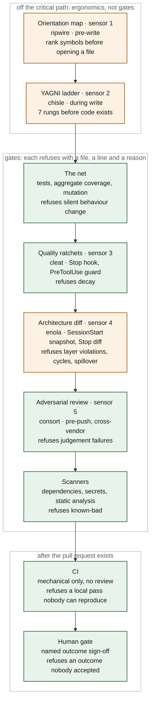

# Dark factory

A reference design for lights-out software delivery: humans specify outcomes and inspect
evidence, machines build, verify and ship, and every human touchpoint is a decision on
evidence rather than an inspection of code.

The design was derived from running the loop on a real product (kvart, an apartment
association management SaaS with money paths and a 4-locale UI) and from bootstrapping the same
loop onto a legacy Java core of 75 modules inside a group of companies. Every mechanism here
was either measured in one of those two places or is labelled as designed or proposed.
`STATUS.md` is the ledger.

## The claim in one paragraph

An agent generates code faster than people can read it. So the review load has to move off
people and onto gates, and gates have to be mechanical wherever they can be (ratchets that
only tighten, architecture diffs, coverage of changed lines, egress allowlists) and
inferential only where they must be (a cross-vendor reviewer that never saw the author's
context). What compounds is not the model, it is the verification net, the team knowledge
plane and the gates: every feature that lands makes the next one cheaper and safer. That is
the flywheel. The humans that remain do three things: approve intent, accept behaviour on
evidence, and press release.

## The line, end to end

Nine layers sit between an agent writing a line of code and a person pressing merge. Five of
them are the sensors of [05-sensor-stack](docs/05-sensor-stack.md). Two are
builder ergonomics and stay off the critical path. Five are gates inside the agent's own loop,
before a pull request exists. Two run after it. The order is an economic argument, not a taste:
the reviewer is the most expensive resource on the line, so a review of code that a ratchet
would have failed is waste.

Fill is the evidence class, never the severity: green is **measured**, amber is **designed**
(wired, not yet exercised end to end). `STATUS.md` is the ledger and wins any disagreement with
this picture.

| Layer | Tool | When | Refuses | Class |
|---|---|---|---|---|
| Orientation map (sensor 1) | ripwire | pre-write | nothing, it is not a gate | `designed` |
| YAGNI ladder (sensor 2) | chisle | during write | over-building, advisory only | `designed` |
| The net | tests, coverage, mutation | post-write | silent behaviour change | `measured` |
| Quality ratchets (sensor 3) | cleat | Stop hook | decay against a pinned baseline | `measured` |
| Architecture diff (sensor 4) | enola | Stop hook | layer violations, cycles, scope spillover | `designed` |
| Adversarial review (sensor 5) | consort | pre-push | judgement failures | `measured` |
| Scanners | dependency, secret, static analysis | pre-push | known-bad | `measured` |
| CI | the project's workflows | post-PR | a local pass nobody can reproduce | `measured` |
| Human gate | a named person | pre-merge | an outcome nobody accepted | `measured` |

The five sensors keep the numbering they carry in [05-sensor-stack](docs/05-sensor-stack.md);
the other four layers are not sensors and are deliberately unnumbered, so there is one
numbering scheme in the repository rather than two.

Two of CI's checks, lint and tests, are a deliberate re-run of checks that already passed in
the agent's loop. They repeat because the first run happened on the author's machine under the
author's hooks, and the guard protecting those hooks is a speed bump rather than a wall. The
only real control is branch protection. See [06-verify-gate](docs/06-verify-gate.md).

## Measured, in brief

| What | Number | Where |
|---|---|---|
| Dev hat on to code PR open, one-line fix with full gate | 12 min 11 s | [cycle 1](case-studies/kvart-reference-implementation.md) |
| Dev hat on to live in prod, same fix, including human merge | ~28 min | cycle 1 |
| Dev hat on to code PR open, 1,383-line retirement of a money path | 18 min 58 s | [cycle 2](case-studies/kvart-reference-implementation.md) |
| Share of that time spent in the cross-vendor review | 52 to 58 % | cycles 1 and 2 |
| Real defects the cross-vendor reviewer found that tests and lint passed | 1 SERIOUS perf regression (trial), 1 HIGH money-path regression (cycle 2) | [trial](case-studies/kvart-head-hands-trial.md), cycle 2 |
| All-in cost per shipped feature on kvart, Aug 8 to Sep 7 2026 | ≈ $96 list price | [measurement](docs/10-measurement.md) |
| Coverage the legacy core actually had once measured on the aggregate, not per module | 55.6 % (per-module sum said 36.8 %) | [legacy adoption](docs/09-legacy-adoption.md) |
| Money-path lines the module-level tiering could not see | ~16,700 of 22,143 | legacy adoption |

## Read in this order

1. [Glossary](docs/00-glossary.md)
2. [Principles](docs/01-principles.md): gates not instructions, verification discipline, humans inspect output
3. [The loop](docs/02-loop.md): SPEC, BUILD, VERIFY, SHIP, LEARN and the two write-backs
4. [Operating contract](docs/03-operating-contract.md): the behavioural rules every agent session loads
5. [Knowledge plane](docs/04-knowledge-plane.md): specs, decision records, memory, and how they stay true
6. [Sensor stack](docs/05-sensor-stack.md): the four mechanical layers that run before any model reviews
7. [Verify gate](docs/06-verify-gate.md): the cross-vendor review, its three axes, and how to prove it ran
8. [Roles and authority](docs/07-roles-and-authority.md): who decides what, and what agents may never do
9. [Sandbox and isolation](docs/08-sandbox-and-isolation.md): worktrees, egress, identity
10. [Legacy adoption](docs/09-legacy-adoption.md): the verification-net bootstrap for a core with no net
11. [Measurement](docs/10-measurement.md): what to baseline before agents dominate, and the bar for "it paid off"
12. [Scaling](docs/11-scaling.md): the blast-radius ladder, DAG not swarm, width that is earned
13. [Adoption playbook](docs/12-adoption-playbook.md): turn 0 to turn N for a healthy repo, a legacy core, a solo owner, an organisation
14. [Failure catalogue](docs/13-failure-catalogue.md): every trap that cost an hour, with its fix
15. [PM surface](docs/14-pm-surface.md): the PM workspace, its skill catalogue, the intake-to-ticket pipeline
16. [Design system](docs/15-design-system.md): tokens, patterns, components and divergences as a knowledge-plane layer
17. [Inventory](docs/16-inventory.md): every mechanism mapped to the tool or template that provides it, and what an adopter without a standard must build
18. [Onboarding a repository](docs/17-onboarding.md): the Day 1 runbook, retro-generated specs, mined decision records, the team-context repo, the memory move
19. [Flightlist](docs/18-flightlist.md): the tickable setup sequence for the next project, one mechanical check and one evidence pointer per leg

Then the [case studies](case-studies/), the [evidence](evidence/), the [templates](templates/),
the [skills](templates/skills/) a team copies into its workspaces, and this design's own
[decision records](adr/).

## What this is not

- Not a tool. It composes tools that exist (cleat, consort, memspec, enola, ripwire, a context
  standard, a devcontainer template) and says where each sits and why.
- Not a claim that review can be removed. It is a claim that review can be moved: from reading
  diffs to reading evidence, and from every change to the changes that carry risk.
- Not finished. `STATUS.md` says which rungs are measured and which are still a drawing.

## Provenance

Derived 2026-09-07 from the kvart dogfood (Day 1 bootstrap, cycles 1 and 2, the sensor-stack
wiring), the 2026-09-05 head-and-hands harness trial, and the 2026-09-04 to 09-07 legacy-core
flywheel work. See [WRITING.md](WRITING.md) for the anonymisation and evidence rules this text
follows.
