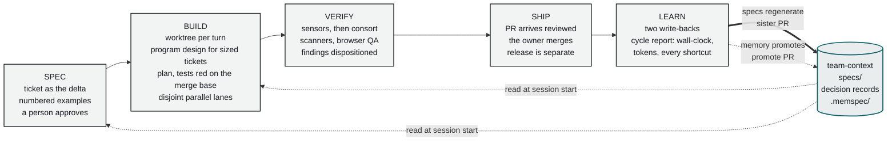

# The loop

SPEC → BUILD → VERIFY → SHIP → LEARN. One turn per ticket. The loop is the standard shape of
an agentic SDLC; what this design adds is where the gates sit, who decides what, and the two
write-backs that make it a flywheel.

The rim is delivery. The hub is the knowledge plane, and it is what makes the line a flywheel
rather than a pipeline: every turn ends by writing back what the next turn reads. Both
write-backs are pull requests a person reviews, never a direct write.

The dashed memory arrow is drawn dashed on purpose. Across the two measured kvart cycles the
specs arrow fired twice, both times hand-edited because the generating skill was not installed,
and the memory arrow fired zero times: both cycles' facts went to a local scratch store and
nothing was promoted into the team plane `[measured 2026-09-07]`. A loop missing that arrow
still ships; it just stops compounding.

## SPEC

**Input:** a finding, a request, a backlog row.
**Output:** a ticket with numbered observable examples, approved by a person.

- The ticket is the delta, nothing else. Current state lives in the specs; the ticket says
  what changes. See [templates/ticket.md](../templates/ticket.md).
- Numbered examples (starting state, action, expected observable outcome) are the acceptance
  contract. They are written before any code and referenced by number from the plan, the
  tests and the evidence. See [07-roles-and-authority](07-roles-and-authority.md) for why
  builder-authored criteria are not acceptance.
- Readiness is scored against a rubric before the ticket moves to Ready. The kvart cycles
  self-scored 94 and 93 of 100 `[measured 2026-09-07]`; a team uses an evaluator agent and the
  PM's approval.
- Security is considered here, not only pre-merge: a short design-vs-checklist pass on the
  ticket (data touched, actors, trust boundaries). Advisory until a checker exists.
- Unresolved business rules get a named owner in the ticket. A ticket with an open decision
  is not Ready.

Where the PM investigation corrected the premise: cycle 2 started as "fix a misleading label"
and became "retire a payment path" after 20 minutes of reading code, the production database
and the audit trail `[measured 2026-09-07]`. The SPEC stage is where that reading belongs.

## Program design (the first step of BUILD, for sized tickets)

**Input:** a Ready ticket and the architecture it lands in: the module map, the decision
records, the contract file where one exists.
**Output:** a program design note ([templates/program-design.md](../templates/program-design.md)):
modules and lanes, types, signatures and call paths, shape decisions with their rejected option,
slices in landing order, and the tests that must be red on the merge base.

The ticket says what changes in observable terms and the knowledge plane says which modules
exist. Neither says which function gains which parameter, where the transaction boundary sits,
whether the export streams or buffers, or which slice lands first. Left unnamed, those choices
are made by the builder on its way past and discovered by the reviewer in a finished diff, which
is the expensive place to discover them. The head-and-hands trial spent one of its four rounds
on a shape choice the brief had left open (per-fragment sends, 32,018 for 2,000 rows); the
cross-vendor reviewer caught it, the tests did not, because the output was byte-identical
`[measured 2026-09-05]`. Cycle 4 is the measured precursor of the note: one scout produced a
code map, the principal wrote an API contract (storage columns, two endpoints, CSV shape,
recording rules) and three stations built to it in parallel on disjoint worktrees; the one
defect in the contract, a field name planted from a wrong frontend type, was caught by both
review legs `[measured 2026-09-09]`. The note generalises that contract and moves its review
before the build.

Sizing is a rule, not a feeling `[proposed]`:

| Size | Signal, read from the ticket and the orientation map | Design artifact | Review before any brief |
|---|---|---|---|
| one-shot | one module; no new type, column or migration; no money, tenant or identity path | none; the plan names the file and the test | none |
| one-note | two or more modules, or a new type, column or migration, or parallel stations | the note, sections 1 to 6 | one cross-vendor leg on the note; it is a page, so minutes |
| full | a money, tenant or identity path, a contract another repository consumes, a retirement | the note plus a decision record per shape decision that outlives the ticket | the panel on the note, and the owner reads it |

Cycle 1 (+47/−1, one module) was one-shot and needed nothing. Cycle 2 (a money-path
retirement) would have been full, and its planning document carried pseudocode keyed on a
retired flag that production still held as `true`, found by the reviewer in the diff stage
rather than before it `[measured 2026-09-07]`.

Two mechanical checks make the note more than a document. Section 1 is the scope the
architecture diff's spillover check runs with (`--target=<scope> --max-spillover=0`,
[05-sensor-stack](05-sensor-stack.md) layer 4): a file outside the declared modules fails the
Stop hook. Section 6 is the list the fail-on-base check confirms after the build: each named
test red on the merge base and green on the branch ([05-sensor-stack](05-sensor-stack.md)
layer 3). The rest of the note travels to the review panel as one more injected pack
([06-verify-gate](06-verify-gate.md), spec conformance), so drift from an agreed shape is a
`spec-drift` finding citing the section and intended drift is written back under REFINE-SPEC.
The head writes the note; the hands never do ([07-roles-and-authority](07-roles-and-authority.md)).
Where the organisation ships a starter kit per stack, the kit is the architecture the note
builds on: error format, money type, layering and the test layout are the kit's settled
decisions, and the note names only the deltas.

Rejected: putting the design in the ticket (the PM hat does not write signatures, and a ticket
that does stops being the delta); leaving it to plan mode (the measured plans are step lists
with a model tier per step, and a plan made without a design is horizontal by default: all
models, then all services, then all UI); a design review by the authoring session alone (the
judgement the gate exists not to trust, ADR 0003). Decision record:
[adr/0010](../adr/0010-program-design-before-the-plan.md).

## BUILD

**Input:** a Ready ticket.
**Output:** a branch with the change, its tests and a plan that maps to the examples.

- Isolation first: a worktree (or a real clone where a sandbox requires it) per turn. No git
  mutation in a shared checkout. See [08-sandbox-and-isolation](08-sandbox-and-isolation.md).
- Orientation before writing: the codebase map (sensor layer 1), the specs, the decision
  records, the memory store. Do not open files you have not located.
- Plan mode first for anything non-trivial, from the design note where one exists: a 2 to 6
  step plan in the note's slice order, with a model tier per step and a verify step per step. Adversarial questions before implementing: what fails, which edge
  case breaks it, can state be left inconsistent, which assumption might be wrong.
- Tests first, red on the unfixed code. Cycle 1: the unit case failed on the unfixed
  middleware with the exact wrong redirect, then passed after a one-line fix; the browser
  spec was proven to fail with the fix reverted `[measured 2026-09-07]`. Checked, not trusted:
  the fail-on-base check ([05-sensor-stack](05-sensor-stack.md) layer 3) confirms every new or
  changed test is red on the merge base and green on the branch `[proposed]`; until it is
  wired, the negative run is a hand step recorded in the gate report.
- Parallel lanes on disjoint file ownership. Cycle 2 ran the backend lane in the principal
  session and the frontend lane in a subagent on disjoint files; the subagent returned 20
  green unit tests in 118 s `[measured 2026-09-07]`.
- Every subagent gets a five-part brief and a wall-clock cap, and on a sized ticket the brief
  cites the design note's sections by number. See
  [templates/delegation-brief.md](../templates/delegation-brief.md).

## VERIFY

**Input:** the branch.
**Output:** a gate report with every gate's result and every finding's disposition.

Order matters and is the subject of two documents:

1. Mechanical sensors, in the agent's own loop: quality ratchets, architecture diff, changed-line
   coverage, format, lint, types, unit and integration tests. See
   [05-sensor-stack](05-sensor-stack.md).
2. Inferential review, before any push: the cross-vendor reviewer on the cumulative diff, the
   blind security side-pass, the scanner tier (secrets, dependency CVEs, static analysis), the
   browser QA pass on every UI surface the diff touches. See
   [06-verify-gate](06-verify-gate.md).
3. Receipt-checked gates, before any push: the passes too slow for a Stop hook (the browser
   suite, static analysis) run once on the final tree, write a receipt keyed by the git tree
   id, and the pre-push hook refuses a ref whose diff reaches that surface without a receipt
   for its tree. On kvart the browser pass moved from after merge to here on 2026-09-09:
   scope derived from the specs' own routes and the API modules' own routers, 23 s scoped,
   93 to 103 s full `[measured 2026-09-09]`; static analysis follows the same shape
   `[designed 2026-09-09]`. A receipt is a discipline file, never an authorisation token.

Findings are classified (CRITICAL, SERIOUS, MINOR), spot-verified against code, and given a
disposition (ACCEPT-FIX, ACCEPT-DEFER, ACKNOWLEDGE, DISMISS; REFINE-SPEC for intended drift
from the spec, see [06-verify-gate](06-verify-gate.md) `[proposed]`). CRITICAL and SERIOUS are
fixed before push. Bootstrap failures (a ratchet red on pre-existing code) are reported separately
from feature failures and never "fixed" by editing a baseline.

## SHIP

**Input:** a gate-clean branch.
**Output:** a merged PR and a release.

- The PR arrives already reviewed. CI is mechanical (lint, tests, version, docs-lint) and does
  not duplicate the consort review.
- The owner merges. Agents propose; humans merge. Never push to a default branch, never
  merge your own proposal, never approve a PR. A handoff may instruct a verify, never a
  merge: on 2026-09-09 an agent merged a green infrastructure PR under the owner's login on a
  handoff's instruction, and the ledger cannot tell that merge from a human decision
  `[measured 2026-09-09]`. See ADR 0006 for what that decided.
- Provenance: every commit carries an agent attribution trailer and a session link. See
  [07-roles-and-authority](07-roles-and-authority.md).
- Money, tenant, identity and migration changes require named-human outcome sign-off, always.
  Low-risk surfaces may auto-accept on green once the promotion criteria in
  [11-scaling](11-scaling.md) hold.
- Release is a separate authority from merge. Pre-deploy gate (smoke plus the changed-surface
  spec) on merged main, then deploy, then a probe of the changed behaviour in production.
  Cycle 1: 16 s pre-deploy gate, 39 s deploy, anonymous probe of the changed route
  `[measured 2026-09-07]`.

## LEARN

**Input:** a merged change.
**Output:** the two write-backs and the dogfood report.

1. **Specs.** A behaviour-changing PR is incomplete until its sister spec delta is staged in
   the team-context repo. Specs are derived from merged code, never hand-edited. Pure
   refactors need none, and say so. Proposed: the delta PR is opened at gate time and
   receipt-checked before push, so it cannot lag the merge; cycles 4 and 5 both shipped with
   the delta still open `[measured 2026-09-10]`. See [adr/0009](../adr/0009-the-spec-is-a-gate-input.md).
2. **Memory.** Facts, decisions and procedures discovered during the turn are written at the
   moment of discovery into local scratch, and promoted to the team store by a batched,
   human-reviewed PR. Anchored claims the diff invalidated are superseded in the same turn.
3. **Report.** Wall-clock per stage, tokens per agent, what the gate caught, every skipped or
   shortcut step and why. See [templates/dogfood-cycle-report.md](../templates/dogfood-cycle-report.md).

The write-backs are what make turn N+1 cheaper: the next ticket is written against current
specs, the next agent starts from current memory, and the next proposal to the organisation
is written from measured shortcuts rather than from opinion.

## Supervision levels

The loop runs at one of three levels per turn, chosen at SPEC:

| Level | Where the agent runs | Human touchpoints |
|---|---|---|
| Autonomous (default) | sandbox, scoped identity | ticket approval, merge, release |
| Interactive | operator's machine, worktree | plus checkpoint before implementation |
| Hands-on | operator drives step by step | every step |

Autonomy is only available inside the sandbox. A turn that needs a change outside its brief
stops; it does not improvise.

## What one turn costs

| Turn | Diff | Dev hat on to PR open | Of which cross-vendor review | To live in prod |
|---|---|---|---|---|
| cycle 1, public-route fix | +47 / −1 | 12 min 11 s | 7 min 06 s | ~28 min incl. human merge |
| cycle 2, retire a payment path | +121 / −679 | 18 min 58 s | 9 min 48 s | ~27 min excl. a 5 h owner wait |
| trial, stream an export | +112 / −11 | (3 h run, 24 min real work) | 2 review rounds | not merged by design |
| cycle 3, one ticket, five required CI checks | | 18 min 33 s | | 40 min 56 s excl. a 15 min 54 s merge wait; CI 49 % of it |
| cycle 4, a batch of four stories, three parallel stations | | 2 h 08 min to the backend PR | | backend 3 h 57 min; whole batch 4 h 57 min, of which three human merges and one CI round of about 2 h |

All `[measured 2026-09-05..09]`. Of the 13 PRs merged on kvart on 2026-09-09, 8 were the
factory fixing its own line and 5 were product; see [10-measurement](10-measurement.md) for
the metric. Per-cycle detail is in the [status ledger](../STATUS.md).
