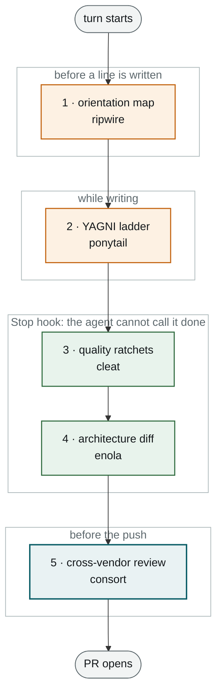

# Sensor stack

Four mechanical, model-free layers around every change, in the agent's own loop, before any
model reviews anything. Together they substitute for the human eyes a dark factory removes.
Each is deterministic, near-zero cost per run, and produces structured output a person or a
dashboard can read.

| # | Layer | When | Catches | Tool used here |
|---|---|---|---|---|
| 1 | Orientation map | pre-write | the agent not knowing what it is touching: call graph, blast radius, existing exemplars | ripwire |
| 2 | YAGNI ladder | during write | over-building: code that should be a stdlib call, a platform feature, one line, or nothing | ponytail |
| 3 | Quality ratchets | post-write, Stop hook | complexity growth, escapes, duplication, dead symbols, layering, changed-line coverage, public API loss | cleat |
| 4 | Architecture diff | post-write, Stop hook | layer violations, cycles, scope spillover, cross-repo seams: what THIS change did to structure | enola |
| 5 | Cross-vendor review | pre-push | intent, security, design, novel risk: the only inferential layer | consort, see [06](06-verify-gate.md) |

Ordering rationale: the reviewer is the most expensive resource, and a review of code that a
ratchet would have failed is waste. Adoption order when starting from nothing: ratchets first
(simplest integration, immediate value), architecture diff second, the two pre-write layers
last (they are builder ergonomics, not gates, and stay off the critical path).

Every tool here is third-party and open source. The decision is the composition and the
placement, not the tools. Swap any of them for an equivalent that has the same property:
deterministic, baselined, fails with file and line, refuses to explain how to loosen itself.

Where each layer fires inside a single agent turn:

Layers 1 and 2 are amber because they are ergonomics: they change what the agent reads and
writes, they never refuse. Layers 3 and 4 are the mechanical gates. Layer 5 is the only
inferential one.

The chain is drawn straight, but layers 3 and 4 do not return to the caller on failure: a red
Stop-hook gate is not a report a person reads later, it is handed straight back to the agent as
the next thing to fix, and the turn does not end until it is green or a person has accepted the
site into a baseline. That hand-back is the whole reason a ratchet in the agent loop is worth
more than the same check in CI.

What is wired where, as of 2026-09-07:

| # | Layer | Checks in use | kvart | The legacy core |
|---|---|---|---|---|
| 1 | ripwire | symbol and call-graph rank, project MCP server, skill exfiltration scan | wired, index unverified across worktrees | not wired |
| 2 | ponytail | plugin at project scope, marketplace source pinned | wired, no trial on a complex task yet | not wired |
| 3 | cleat | escapes, duplication, complexity, layering, changed-line coverage, conventions, test hygiene, doc size, public API loss | 6 gates on main, 4 sites accepted into the baselines | ratchets adopted, 0 layering violations, no exemptions |
| 4 | enola | layers, cycles and intent (provable); scope spillover and cross-repo seams (heuristic) | wired, 12 module-level crossings pinned | not wired |
| 5 | consort | Codex backend, Gemini backend, blind security side-pass, browser QA pass, rule packs | 3 runs, 4 real defects | measured |

The provable and heuristic split in layer 4 matters for gating. Only `layers`, `cycles` and
`intent` report at confidence 1.00, so those three are the recommended starting gate; the rest
need a confidence floor before they can refuse anything.

## Layer 1: orientation map (pre-write)

A deterministic index of the codebase (symbols, call graph, co-change, ownership) that answers
"what am I touching, who calls it, what already does this" in a few hundred tokens instead of a
fan-out of whole-file reads. Less context is measurably more accurate, not just cheaper: code
repair accuracy fell from 29 % to 3 % as context grew from 32K to 256K tokens in one benchmark
`[field: LongCodeBench, as cited by the tool]`.

Reflexes it installs: rank before reading; expand one symbol rather than open its file; check
for an exemplar before writing a new helper; run a quality delta before calling work done.

Caveats before production adoption: keyword retrieval can miss domain vocabulary (verify on real
tasks with the project's identifiers); confirm the index behaves in a worktree-per-agent
layout, because that is exactly the 3 to 5 trees-per-operator pattern the factory runs
`[designed]`.

## Layer 2: YAGNI ladder (during write)

A 7-rung decision ladder the agent climbs before writing code: does this need to exist; is it
already in this codebase; does the stdlib do it; does the platform do it; does an installed
dependency do it; is it one line; only then, the minimum that works. Security, validation, error
handling and accessibility are never on the chopping block.

Published benchmark on a generic web stack: −54 % lines of code mean, −20 % cost, −27 % time,
with near-zero reduction on already-minimal code `[field: ponytail README, n=4]`. Under a
subscription model less code compounds: less future agent work per feature.

Caveats: the top public reply to the tool's launch was "made my agent lazy", a real risk on
complex domain tasks; the plugin ships lifecycle hooks, so inspect them before trusting; it
cannot be revision-pinned through the marketplace format, so a real pin means a fork or the
organisation's vetted catalog `[designed; trial on one complex multi-file task before rollout]`.

## Layer 3: quality ratchets (post-write)

The load-bearing layer. Nineteen checks, each a ratchet: the baseline records the debt present
on adoption day, and new debt fails. Wired as a Stop hook (the gate runs when the agent stops,
and a failure is handed back as the next thing to fix) and a PreToolUse guard (the agent cannot
edit the policy, the baselines or the hooks).

Gates used on kvart and the legacy core: doc-size (a document an agent reads growing past its
ceiling), test-hygiene, escapes (`# type: ignore`, `any`, `|| true`, `.skip`, keyed by site),
conventions (your own regex rules, your message at the site), duplication (a copied block in
changed lines), complexity (cyclomatic over 8 or 60 lines), layering, changed-coverage (changed
lines the tests did not run, minimum 0.8), public-api.

Rules that are not obvious until you have been bitten:

- **The failure names the fix, never the whitelist.** "Accepting a site into the baseline is a
  policy decision for a person." The agent block in the instructions forbids editing the policy
  to satisfy the gate, and the guard enforces it.
- **Baselines are tied to a tree state.** Adopting the gate onto a newer main legitimately
  requires re-cutting the baseline once, as a deliberate act by a person, recording main's real
  day-one debt. kvart's re-cut named 4 accepted sites in the commit message
  `[measured 2026-09-07]`.
- **`base_ref` must be the real default branch.** Pointed at a branch 81 commits behind, the
  duplication gate judged 19,431 lines as changed and reported 557 clone pairs; pointed at the
  right one, 6, all real `[measured 2026-09-04]`.
- **Exclude vendored static assets and, on an un-netted core, test trees.** 267 of 407 raw
  complexity findings were vendored JavaScript; a gate that fails new tests fights the turn whose
  purpose is to grow tests `[measured 2026-09-05]`.
- **Walkers must honour the ignore file, or nested worktrees poison the tree.** The agent runtime
  nests other branches' worktrees under the repo; the walkers pruned by directory name and read
  every nested tree, sending 3 of 6 gates red in the primary checkout. Config-only fix, proven
  with planted files `[measured 2026-09-07]`.
- **The guard is a speed bump, not a wall.** `python3 -c` walks past a PreToolUse guard. The
  control is branch protection; the guard exists to make the honest path the easy path.
- **Line-based clone detection flags import blocks.** A token-based finder was measured and made
  it worse (5 pairs vs 1), and no token threshold separates import blocks from real clones
  (overlapping distributions, p50 62 vs 69). The real fix is upstream: skip import lines. Do not
  raise `min_lines` `[measured 2026-09-05]`.
- **The right tool must answer to the right name.** A package manager installed a compressor
  under the complexity analyzer's binary name; the gate would have read nonsense instead of
  erroring. Verify with `--help`; pin the analyzer in a venv `[measured 2026-09-05]`.

What it caught for real: 2 new escape comments and a function over 60 lines in a hands
implementer's first pass `[measured 2026-09-05]`; 6 genuine copy-paste blocks in a
characterization test that had a 100 % mutation score `[measured 2026-09-04]`; a baselined
function that had doubled on main `[measured 2026-09-06]`.

Consort review of the vendored ratchet source itself produced 17 findings in 20 min 19 s: 2
real in the adopter's config (an argv injection via a changed path beginning with `-`, a
`MULTILINE` anchor baselining an empty-text site), 11 product defects deferred upstream
`[measured 2026-09-07]`. A gate is code too and gets the same review.

## Layer 4: architecture diff (post-write)

A snapshot of the codebase's structure (modules, symbols, routes, storage, dependencies) pinned
as a baseline before editing and diffed after. It reports only what the change did: findings
introduced or resolved, coupling added, a cycle spanning four files, a layer crossed the wrong
way. Nothing without a baseline can tell a regression you just introduced from the hundreds
already there, which is why this is not a linter and does not replace one.

Configuration is a layer declaration (kvart: entry → service → domain → models → foundation)
plus the existing crossings pinned as accepted. kvart's declaration pinned 12 module-level
crossings; the real one is nine service modules lazy-importing an authorisation helper from the
entry layer `[measured 2026-09-07]`. Every future crossing is a decision, not inherited debt.

Three explainers are provable (confidence 1.00): `layers`, `cycles`, `intent`. Everything else
is heuristic and needs a confidence floor to gate on. Out of the box it fails nothing; the
recommended starting gate is the three provable ones. The scope-spillover check
(`--target=<declared scope> --max-spillover=0`) is the mechanical form of "the builder stayed in
its lane" and doubles as the architecture gate a scaling factory needs
([11-scaling](11-scaling.md)).

Cross-repo: an intent file can declare seams between repositories, so a builder importing
across a service boundary without declaring the dependency fails even though build and tests
pass. The other layers do not cross repo boundaries `[designed]`.

Hooks: session-start snapshot, Stop diff, a doctor command that verifies the hooks actually
fired. Config is not execution; the doctor closes that gap.

## Wiring, as measured on kvart

- Hooks live in the tracked agent settings file: PreToolUse guard, Stop (ratchet gate on changed
  files, then architecture diff), SessionStart (architecture snapshot). Every entry is
  PATH-guarded so it is a no-op where the binary is absent; nothing here runs in production
  images.
- Binaries per machine, pinned, in the user's local bin; the analyzer in its own venv.
- The settings file is a supply-chain tripwire, so it is tracked and its diff reviewed. The
  attach step wrote exactly two hooks, both invoking the gate; verified by diff.
- Two agent config directories exist on one machine (plain terminal vs the canvas runtime);
  a plugin registered in one is absent in the other.
- Rule files for layers 1 and 4 sit next to the other path-scoped rules and say when to reach
  for each verb. See [templates/sensor-config-examples.md](../templates/sensor-config-examples.md).

## What this stack is not

Not a replacement for the cross-vendor review. It is a prerequisite filter that reduces that
review's surface to the non-trivial problems, and it cannot see intent, security semantics or
design.
