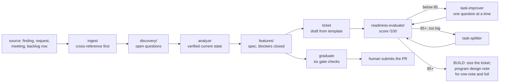

# The PM surface

The loop starts before any agent touches code. Someone has to turn a finding, a complaint or a
backlog row into a ticket with numbered observable examples that a fleet can build against and a
person can accept on. That work has its own workspace, its own skills and its own gate, and it is
the least automated part of the factory: [02-loop](02-loop.md) says SPEC ends with "a ticket
approved by a person", and this document says what the person and their agent actually work in.

The short version: a per-PM local repository from a template, a catalogue of skills that read the
specs before the code and never write outside the workspace, a numeric readiness rubric with a
threshold, and exactly one gated path out of the workspace into the team layer.
[04-knowledge-plane](04-knowledge-plane.md) covers the four knowledge layers this surface reads
and the one it may propose to; this document does not repeat them.

## The workspace

One local repository per PM, created from a template, cloned next to the read-only clones of the
specs repository and the code repositories. It is a working environment, not a publication: the
design calls it the swamp, because half-formed material is supposed to live somewhere that is not
the team's source of truth.

| Folder or file | Holds | Lifetime |
|---|---|---|
| `_Inbox/` | dropped sources not yet processed | until ingested |
| `discovery/` | research, open questions, gap analysis | until enough is known for a spec |
| `features/` | specs ready for ticket writing | until graduated |
| `<tickets>/` | drafted tickets, one subfolder per epic | until the tracker owns them |
| `Meetings/` | processed memos; `Meetings/Raw/` holds transcripts and pulled mail, git-ignored | memo permanent, raw local only |
| `Stakeholders/` | names and roles | permanent, never in an external query |
| `Decisions.md` | what was actually decided, not discussed | permanent |
| `Action-Points.md` | ID, action, owner, deadline, status | until closed |
| `Waiting-On.md` | outstanding asks with the date sent | until answered |
| `Todo.md`, `Ingest Log.md` | the daily tracking layer | rolling |
| `outputs/` | reports and deliverables | permanent |
| `session-logs/` | one log per refinement session, with score progression | permanent, mined by a skill |
| `reference/` | how things work now, stable knowledge | permanent |
| `templates/` | story, epic and product-spec templates | permanent |
| `POINTERS.md` | where every read-only clone lives and what it answers | permanent |
| `TRACKER.md` | the tracker's project key, board, issue types in use, epic-parent convention and the label table with a meaning per label | permanent, corrected in place from ticket previews |
| `SENSITIVITY.md` | the tier that decides what may leave the machine | permanent |
| `.claude/skills/` | the skill catalogue below | permanent |

Two rules give the workspace its shape.

**The write contract.** The specs repository and the code repositories next to the workspace are
read-only. The agent never writes, commits, pushes or opens a pull request against them. The only
path out is the graduate skill, which prepares a package that the human submits. Half-baked
material stays in the swamp by design, which is what keeps the team layer worth reading.

**Sensitivity in both directions.** Outbound, the tier in `SENSITIVITY.md` decides what may appear
in a web search, a fetch, or anything pasted into an external tool; the default tier is Sensitive,
which means generic topics only and no company-specific data, names or figures. Inbound, capture
is minimisation rather than transcription: a memo carries decisions, action points, asks and
facts, and personal remarks, salary content and privileged passages are omitted with a note
pointing at the source. Raw transcripts stay in the git-ignored folder.

### Why it is a repository the PM never runs git in

The workspace is version-controlled because everything else in the factory is: history, diffs,
recoverable state, and the ability to hand a PM a fresh machine and reproduce their context. It is
not version-controlled so that the PM learns git.

- The PM's job on this surface is judgement, not mechanics. Every git operation the workspace
  needs is either done by the agent inside the workspace or, for the one hop that leaves it,
  offered as two routes: the exact commands, or a click path in the hosting web interface with a
  fallback of sending the package to someone who will submit it.
- Read-only clones are set up once, by whoever runs the adoption, with scoped tokens. The PM never
  refreshes them by hand; if the agent reports a clone stale or unreachable, that is a question to
  ask, not a command to learn.
- The write contract is easier to enforce than to explain. A PM who cannot push cannot push
  half-formed material into the team layer at 23:00, and the gate stays the gate.

The cost is real and worth naming: a PM who never runs git also never sees a merge conflict, so
the agent must surface staleness loudly rather than working from a remembered state.

### The PM runs the same tooling as the engineer

Decided in the group's planning session with its PMs and engineers on 2026-09-15: PMs hold the
same permission level as engineers. Recorded as tooling and access parity: the same agent runtime
(the terminal one, with skills, plugins and local clones, rather than the desktop assistant working
on one folder through connectors), the same connectors, read access to the code, specs and
design-system repositories, and the tracker. It does not change authority: the PM still authors
proposals and approves tickets, code owners still merge the team layer (adr 0005, adr 0006), and
the write contract above is unchanged.

What it changes is the surface. The earlier launch position, that PMs read repositories only
through a hosted connector because git on their laptops and clone placement outside a synced
folder could not be assumed, is superseded: the PM's machine is set up like an engineer's, clones
in `POINTERS.md` are local, and multiple repositories are the normal case rather than a
limitation. Two constraints survive the change: the workspace must not live inside a
cloud-synced folder (a `.git` directory under file sync corrupts), and PM plugins stay
available-to-install rather than enabled for everyone, because PMs are about one in fifty seats.
Visual prototyping stays where it was: the `demo` skill builds it locally, and publishing it
anywhere is the sensitivity decision below. `[decided 2026-09-15, not yet measured]`

## The skill catalogue

Seventeen skills, in the shape the kvart adoption ran them. Names here are generic: rename freely,
but keep the firing conditions in the description, because the description is what decides whether
the skill fires at all. Inputs are given in read order, and the order is itself a rule from the
workspace contract: check the spec first, grep the code when the spec is unclear or silent, ask
the human only when the answer is genuinely not determinable from either, and say what was checked.

"Gated" below means the skill refuses to proceed or requires an explicit confirmation before a
write or a promotion. "Advisory" means it produces something a person then decides on.

Five of the seventeen ship in this repository, anonymised from the reference implementation:
`ticket`, `readiness-evaluator`, `task-improver`, `task-splitter` and `graduate`, under
[templates/skills](../templates/skills/). They are the chain that turns intent into the
structured input every later stage reads: a ticket with numbered examples, scored to the
threshold, split when too large, and graduated into the team layer. The other twelve follow the
same shape ([templates/pm-skill.md](../templates/pm-skill.md)) and are the adopter's to port.

| Skill | Job | Inputs, in read order | Output artifact | Loop position | Kind |
|---|---|---|---|---|---|
| `ingest` | Pull a source into the workspace and, first, find what the workspace already says about it | the source (file, wiki page, tracker item, URL, code grep), then the whole workspace for existing coverage | an entry in `Ingest Log.md` plus writes into `discovery/`, `reference/` or the tracking files, after confirmation | SPEC intake | gated: shows the plan and writes only on confirmation |
| `analyze` | Produce an exhaustive verified picture of an existing feature or flow, not a partial slice | specs, then code entry points, input classes, configuration types, validators, message bundles, feature flags, then workspace notes | an analysis document in the workspace, every claim citing a path or class | SPEC intake | advisory |
| `architect-review` | Senior-engineer adversarial pass over draft tickets before build starts | the domain's specs, workspace reference and open questions, then the frontend and backend code | findings as BLOCKER, MAJOR or MINOR, each with evidence and a concrete fix | SPEC readiness | advisory, but a BLOCKER is a stop |
| `ticket` | Draft a story or an epic from a source spec, with its tracker fields | the source file, then the story and epic templates plus the skill's own style rules, then `TRACKER.md`, then code for gap resolution | a ticket file under the tickets folder with type, project, epic parent, labels and links proposed with a reason each, saved only on approval | SPEC intake | gated: refuses an epic without a `features/` spec, blocks on unresolved product decisions, never writes to the tracker; never proposes assignee, priority, sprint or points |
| `readiness-evaluator` | Score a ticket against a 7-criterion rubric out of 100; on a bigger ticket (money, identity, new data, another consumer, a removal) it asks one extra question, in a fixed order, that the build's design will need | the ticket text, then the domain spec folders, then the workspace notes | a score table, per-criterion gaps with citations, and one highest-impact question | SPEC readiness | gated: below the threshold it hands off to the improver |
| `task-improver` | Conversational refinement loop that raises a weak ticket to the threshold, one question at a time | the ticket, the evaluation output, then the same context sources as the evaluator | a polished ticket, a drift check, and a session log with score progression | SPEC readiness | advisory, with a gated write-back |
| `task-splitter` | Split a ticket that is over about 2 person-days into independently deliverable sub-tasks | the polished ticket only | a split proposal with a coverage check, the parent promoted to an epic | SPEC readiness | gated: proposal, then explicit confirmation before any write |
| `task-degrader` | Degrade a good ticket into a bad one to test the scoring pipeline | a good ticket | a synthetic bad ticket for calibration | LEARN | advisory, test fixture only |
| `improver-optimizer` | Mine the session logs for bottlenecks, drift and stagnation, then propose edits to the improver skill itself | `session-logs/` in bulk | a diagnostic report plus numbered recommendations against the improver's own instructions | LEARN | advisory, applies edits only on request |
| `session-checkpoint` | Save, list, resume and branch a refinement session | the conversation's score tables and question log | a checkpoint file outside the workspace | daily ops | advisory, non-destructive by rule |
| `graduate` | Promote a `features/` file into the team layer | the file, then `POINTERS.md`, then the target repository's spec conventions | a rewritten file plus a handoff package: target path, branch name, title, description, and both submission routes | SPEC to team layer | gated: six checks, all must pass, no partial packages, the human submits |
| `demo` | Build a throwaway clickable, navigable prototype as a stakeholder reaction artifact | a discovery or features file, then the design standards, then the code for the behaviour it mirrors | one self-contained HTML file in the discovery folder; on request, a published private page for stakeholders | SPEC intake | gated by three hard rules: a visible throwaway banner, fake data only, never lands in the team layer. Once the flow is agreed it is attached to the ticket or epic as a design artifact, a load-bearing input for the frontend builder (decided 2026-09-09, not yet measured). Publishing is an explicit sensitivity decision by the PM, never the skill's default |
| `tracker-mcp` | Every read and write against a ticket tracker such as Jira, attachments included | tracker identifiers and the current user, then `TRACKER.md`, then the issues themselves | tracker mutations; design artifacts and screenshots attached to the issue or epic under a "Design artifacts" heading | daily ops and SHIP | gated: preview, confirm, execute on every write. The hosted MCP surface has no attachment call, so attachments go through the tracker's REST endpoint with the PM's own token, under the same preview |
| `release-note` | Turn shipped tickets into a release page entry | the tickets, grouped by user-visible change | a title plus a two or three sentence factual description | SHIP | advisory |
| `morning` | Start-of-day brief with chase and overdue flags | `Todo.md`, `Waiting-On.md`, `Action-Points.md`, then the tracker if connected | a brief under 25 lines: top three, chase list, overdue, blocked, heads-up | daily ops | advisory |
| `wrap-up` | Persist the session's outcomes so nothing agreed dies in the transcript | the conversation | updates to the four tracking files plus a five-line summary of what landed where | daily ops and LEARN | advisory, but capture is mechanical by rule |
| `onboard` | Set up a new PM's workspace and clone the read-only repositories | answers from the PM, one question at a time | a personalised workspace instruction file and the clones | day 0 | advisory |

Three observations about the catalogue as a whole.

- Only three skills are true gates: `ticket` refuses to draft outside the pipeline, `graduate`
  refuses to package a file that fails any of six checks, and any tracker write is preview and
  confirm. Everything else is a document a person reads. That ratio is correct for this stage:
  the mechanical gates in [05-sensor-stack](05-sensor-stack.md) act on code, and there is no code
  yet.
- The pipeline is enforced for epics and relaxed for single stories. An epic drafted from
  unresolved research is refused with a proposed alternative path; a one-story request from chat
  is allowed. Enforcing the full ladder on every one-liner is how a process gets routed around.
- Two skills exist only to improve the skills. The degrader manufactures bad input, and the
  optimizer reads the session logs and proposes edits to the refinement loop. That is the LEARN
  write-back of [02-loop](02-loop.md) applied to the PM surface rather than to code, and it is the
  part most teams skip.

## Tracker fields are deduced, shown, approved, and configured once

A ticket that arrives in the tracker with the wrong issue type, no epic parent or a label the team
does not use is wrong in a way the readiness rubric cannot see, and the group's planning session
named it as a live problem `[decided 2026-09-15]`. The group standard's tracker page defines the
issue types (initiative, epic, story, technical development, bug, sub-task, and a task type outside
the engineering workflow) and the status workflow; it defines no labels, so every label is a team
convention that has to be written down somewhere the agent reads.

Three options, and the design picks the third:

- Ask the PM for the fields every session. Rejected: the same question in every session is the
  workspace failing to remember, and the answers are the same.
- Deduce silently. Rejected: a wrong type or parent lands in the tracker as fact.
- **Deduce from the source, the code and `TRACKER.md`, show every field with its reason in the
  preview, and let the PM approve or correct.** A correction that would apply to every future
  ticket is offered as an edit to `TRACKER.md` in the same approval. The second ticket needs no
  correction, or the configuration is wrong and gets fixed once.

The deduction rules the `ticket` skill applies: a flow a tester or end user can exercise is a
story; work that unlocks a capability with nothing visible is technical development, linked to the
stories it blocks; a defect with steps to reproduce is a bug; multi-story scope is an epic; the
epic parent comes from the tickets folder the draft is saved under; labels come only from the
configured table (an agent-eligibility label set at the readiness gate is the first entry most
teams will want, see [02-loop](02-loop.md) on dispatch). Assignee, priority, sprint and points are
never deduced; they belong to the team lead and grooming.

**Tested on the reference workspace `[measured 2026-09-15]`.** Two fresh headless sessions, one
fixture story under an existing epic folder. With `TRACKER.md` present: the preview carried type,
project, parent, labels and links with a reason each, asked for no configured value, and proposed
one configuration correction (the folder-to-epic mapping had no epic keys, so the two runs disagreed
on the parent: one named the folder, one said "ask once"). With `TRACKER.md` removed: the skill said
so, did not ask for the project key, rebuilt the proposal from the live tracker's own metadata and
found a label in use on 14 issues that the table lacked. Both runs also caught the fixture's three
disagreements with the code (a table name, a status value and a route that did not exist), which is
the read-order rule doing its job. Corrections applied the same day: an epic-key column, the live
label rows, and the vocabulary line.

**Attachments.** Screenshots and the `demo` prototype belong on the issue, and an epic takes
attachments like any other issue. The hosted tracker MCP exposes create, edit, comment, transition
and link, and no attachment call `[measured 2026-09-15]`, so the tracker skill attaches through the
tracker's REST endpoint with the PM's own token, under the same preview-confirm rule as every
write. Until that is wired, the `demo` skill's "attach it to the ticket" step is a hand step in the
tracker's web interface, and the design says so rather than pretending.

**Sharing a prototype.** The prototype is one self-contained file: clickable and navigable across
its screens, fake data, a visible throwaway banner. For stakeholders who will not open a file, the
agent runtime can publish it as a private page in the organisation's own tenancy, or as a design
canvas they can inspect. Both leave the machine, so `SENSITIVITY.md` governs: fake data only, and
the PM decides to publish, per prototype. The skill never publishes by default.

## The readiness rubric

The evaluator scores one ticket out of 100 across seven weighted criteria.

| Criterion | Points | Full marks means |
|---|---|---|
| Objective or problem statement | 20 | why this exists and what breaks without it, in the ticket itself |
| Acceptance or success criteria | 25 | observable outcomes, not implementation bullets |
| Scope boundary | 15 | in scope and, explicitly, out of scope |
| Actor clarity | 10 | which role or permission drives each flow |
| Pre-conditions and dependencies | 10 | what must be true or shipped first |
| Specificity and concrete examples | 15 | exact values, states and messages rather than adjectives |
| Title clarity | 5 | reads as a user value statement or a clear feature name |

Bands: 85 to 100 is Good and ready for planning, 55 to 84 is Decent with significant gaps and one
refinement round likely, 0 to 54 is Bad and needs a full refinement conversation. **85 is the
threshold**, and it is wired rather than advisory: below it the evaluator hands straight to the
improver without waiting to be asked, and the improver's own target is 85 or better. At or above
it the evaluator always offers three paths (record the evaluation and mark ready, keep improving,
or split) and never picks one itself. That threshold matches the ticket template in
[templates/ticket.md](../templates/ticket.md), which carries the readiness line as a field.

Three scoring principles keep the number honest, and they are the reason it is worth having a
number at all.

- **Document-only scoring.** The score is derived solely from text present in the ticket. A gap
  that would need domain knowledge or an adjacent system to fill is still a gap. The score is a
  claim about the document, not about the feature.
- **No scope widening.** The evaluator does not introduce actors, systems or edge cases the
  ticket never mentioned, and a widening question the author rejects is score-neutral. Without
  this rule the rubric becomes a machine for growing tickets.
- **Context lookup does not move the score.** Before scoring, the skill looks for the matching
  current-state spec first and the workspace notes second. Finding them changes the feedback, not
  the number: a gap becomes "the spec already names the actor, cite it from this path", which is a
  copy rather than a conversation. Nothing found means the rubric is applied unchanged.

A drift check runs on the last iteration only: the final version is compared against the original
input and anything introduced along the way that was not present or clearly implied is listed. It
is a warning, never a score adjustment. That is the same failure the improver loop invites and the
same one a builder-authored acceptance criterion invites, which is why
[07-roles-and-authority](07-roles-and-authority.md) puts acceptance on the requester.

## What the program design note needs from the ticket

For a sized ticket ([02-loop](02-loop.md): two or more modules, a new type or column or migration,
parallel stations, or a money, tenant or identity path) the head writes a program design note
before the first brief ([templates/program-design.md](../templates/program-design.md)). The PM
never writes that note and never reads it; the PM's ticket is what it is derived from. The rubric
scores the document, and a document can reach 85 on objective, title and actors while still
leaving the note nothing to work from. What the note needs is concentrated in four of the seven
criteria, and in fields of [templates/ticket.md](../templates/ticket.md) the rubric only measures
indirectly `[proposed]`:

| Note section | Derived from the ticket's | Ready enough when | When it is missing |
|---|---|---|---|
| 1. Modules and lanes | the feature spec the ticket cites, the exclusions | the ticket names which current-state spec it changes and says what a reader would assume is included and is not; the head reads the module map, not the PM | the head sizes from the code alone and the spillover scope is a guess: escalate, ticket back to Ready |
| 2. Types and data | examples that name exact values, the "new data" the desired result implies | every value a user will see or enter is written with its exact form (a state name, an amount, a date, a message); the prototype shows every field for UI work | the builder invents a field name; cycle 4 planted one from a wrong frontend type and both review legs had to catch it |
| 3. Signatures and call paths | actor clarity, the entry point each example starts from | each example says which role does the action and on which surface (page, endpoint, job, message) | entry points are inferred from the code's shape, which is how a reviewer widened scope from the code in cycle 4 |
| 4. Shape decisions | constraints and failure cases, the invariant lines, the budget line | the invariant that must not break is named with the check that proves it; the performance or capacity budget is a number with units or an explicit "none"; the failure path example (AC-n, failure path) exists | the shape is chosen by the builder on its way past: the trial's per-fragment sends were exactly this |
| 5. Slices in landing order | pre-conditions and dependencies, sequencing between tickets | what must be true or shipped first is listed; a ticket that depends on another names it | the plan comes out horizontal (all models, then all services, then all UI) |
| 6. Tests red on the merge base | the numbered examples, one per observable outcome | each example is a starting state, an action and an outcome an independent party can observe; at least one failure path | a test that passes on the merge base is written and the fail-on-base check refuses it after the build instead of the ticket being fixed before it |

Two things the PM writes that the head cannot recover from code:

- **The sizing signals the rubric does not score.** Whether the change touches money, tenant
  isolation or identity; whether it stores something new; whether another repository or the mobile
  client consumes it; whether it retires a path. The PM knows these from the discovery; the head
  can only guess them from the diff it has not yet written. One line each under constraints.
  These are what put a ticket in the full tier, where the owner reads the note before the build.
- **The prototype, for UI work.** Sections 2 and 5 of the note are read off it: the fields, the
  states, the order screens land in. A UI ticket without the agreed prototype attached is not
  Ready for the note, whatever its score. Attached is not enough: each screen the ticket changes
  or introduces names its view in the prototype (`<file>#<view id>`, one per screen, in the
  acceptance criteria), and every route a card, row or button opens has a named view in this
  ticket or in another Ready ticket. An acceptance criterion of the form "X opens the Y list" with
  no view named is satisfiable by the old screen and was, on kvart, 2026-09-17: the new hub cards
  landed on the pre-ramp destination screens and every code gate passed
  ([06-verify-gate](06-verify-gate.md), "Native client QA"). The verifier reads the named view,
  not the ticket prose, when it judges the screenshot.

What the PM does not write, and the evaluator must not ask for: types, signatures, module names,
slice order, shape decisions. Those are the note's job. A ticket that carries them stops being the
delta and the acceptance criteria stop being the requester's (see
[07-roles-and-authority](07-roles-and-authority.md)).

Consequence for the evaluator, written into `templates/skills/readiness-evaluator` and not yet run
on a sized ticket `[designed]`: when the ticket's own text shows a sizing signal
(money, new data, another consumer, a retirement, several features cited), the single
highest-impact question it asks targets a row of the table above, in this order: constraints and
invariants, exact values in the examples, pre-conditions, actor and surface per example. It still
never widens scope; it asks for the field the ticket already implies and has not filled. The
head's own check is mechanical: a note whose section 1, 2, 4 or 6 has to say "not in the ticket"
returns the ticket to Ready with that gap named, and does not guess.

Not measured yet: the two sized cycles so far (cycle 2, a money-path retirement at 93; cycle 4, a
four-story batch) both had their shape decided by the principal in the same session that wrote the
ticket, so no ticket has yet been returned for a note gap. The first sized ticket after this
version is where the table gets its first correction.

## From intake to ticket

The gate checks that `graduate` runs, all of which must pass, are worth copying verbatim into any
adoption: every claim about current behaviour cites a repository and a path, or is marked
unverified and listed; no open decisions or blockers remain; the parent scope maps this item with
no open flags; any estimate carries base plus contingency plus a justification; the ticket
describes what rather than how and its criteria are observable; and nothing in the file exceeds
what the target team repository may contain. On failure it returns a gap list and no partial
package.

### Three states, three homes

The boundary that makes this pipeline work, and the one most likely to be blurred:

| State | Lives in | Written by | Answers |
|---|---|---|---|
| **Implemented** | the team layer's current-state specs | generated from code, then reviewed | what does the system do today |
| **Desired** | the ticket | the product hat, before build | what changes, and how will we know |
| **Proposed** | the workspace `features/` folder | the PM, thinking out loud | what might we do, if we decide to |

Current-state specs are derived, never hand-edited: they are generated from the code and updated
by a sister pull request attached to the commit that changed the behaviour
([04-knowledge-plane](04-knowledge-plane.md), and adr 0007 in this repository). A ticket is the
delta and nothing else, because the current state is already written down. Proposed work is
neither, and it is the reason the workspace exists as a separate repository at all.

**The trap.** `graduate` rewrites a `features/` file into the target repository's spec format and
prepares a pull request into it. Read that sentence again: a proposal, formatted as a spec,
landing in the directory whose entire contract is "this describes what the code does today".
Nothing in the six gate checks tests for it, because every check is about the file's quality
rather than about which state it represents. Merge that pull request and the layer every future
agent session reads as ground truth now contains a feature that does not exist, indistinguishable
from the ones that do. The next session builds against it, or worse, a spec-versus-code drift
check flags the real code as wrong.

Three defences, cheapest first:

1. Graduate proposals into a proposal area or a decision record, never into the current-state spec
   tree. A proposal that survives becomes a ticket; the spec follows the shipped commit.
2. If a proposal must live in the team repository, mark its state in the file's own front matter
   and make the generator's drift check skip anything not marked implemented.
3. Add a seventh gate check to the skill: name the state this file represents, and refuse a
   current-state target for anything other than implemented. This is the only one of the three
   that is mechanical, and it is a two-line change.

## What the kvart adoption measured

Two cycles on 2026-09-07, both PM stage through to production, both reported in
[the case study](../case-studies/kvart-reference-implementation.md).

| What | Cycle 1 | Cycle 2 |
|---|---|---|
| PM stage wall-clock, first look to ticket drafted and scored | ~11 min `[measured 2026-09-07]` | ~29 min `[measured 2026-09-07]` |
| Readiness, self-scored against the rubric | 94/100 `[measured 2026-09-07]` | 93/100 `[measured 2026-09-07]` |
| Dev hat on to code pull request open | 12 min 11 s | 18 min 58 s |

The PM stage is not the expensive stage, and in cycle 2 it is where the value was. Twenty of those
29 minutes went into reading code, the production database, the production logs and the audit
trail, and they corrected the premise: a ticket that started as "fix a misleading label" became
"retire a payment path" once the investigation showed the section had been invisible since May and
the flag was still writable through the API. A 4-minute intake would have produced a fast, correct,
worthless ticket.

Findings about the surface itself, each one a defect in the template rather than in the product:

- **The drafting skill referenced a file the copy did not have.** Its instructions say to always
  re-read the style rules before drafting, and the style-rules file does not exist in this copy, so
  the ticket was drafted from the story template alone `[measured 2026-09-07]`. A template that
  ships with its own lookups broken fails silently, because a missing reference reads as a skipped
  step rather than an error. The check is mechanical and belongs in the template's own test: for
  every path a skill names, assert it exists. Still missing on 2026-09-15, eight days and five cycles later, and reported again by
  both test runs of the tracker-fields step; the eleven rules were written that day and ship with
  the `ticket` skill under `references/`. The lesson stands: a defect that only shows as a skipped
  step is not fixed by noticing it.
- **A ticket tracker, which closed a cycle-1 shortcut.** On 2026-09-07 there was no tracker, so the
  stage was a status line in a file `[measured 2026-09-07]`: tickets lived as files in the workspace
  and moved Ready, In Progress, In Test, Ready for LIVE by editing one line, and four of seventeen
  skills (the evaluator's write-back, the improver's write-back, the tracker skill and the splitter's
  write sequence) had nothing to talk to. It was recorded as a cycle-1 shortcut in a decision record
  rather than papered over. That shortcut is now closed: since 2026-09-09 the reference implementation
  runs a real tracker (Jira) `[measured 2026-09-09]`. Pickup assigns the ticket to the loop's account
  and moves it to In Progress; a workflow moves it In Test on PR open with a remote link, Ready for
  LIVE on green CI or merge, and back to In Progress on red; a deploy write-back closes every ticket
  in the deployed range. Keys come from titles, never bodies, and events never move epics. The first
  write-back closed 6 tickets, and the merge leg moved a ticket 13 s after the merge. Still by hand:
  the "decision needed" post from tracker comments to the escalation channel. One rule the tracker
  taught the same evening: a status is not a resolution. The workflow, created over the API with
  statuses and transitions only, left every Done ticket Unresolved (`resolution = Unresolved`
  matched all of them, `resolvedDate` stayed empty, reports counted nothing as resolved). The
  terminal transition needs a post-function that sets Resolution, and the reopen transitions one
  that clears it; a list view with the Resolution column is the check `[measured 2026-09-09]`.
- **Readiness was self-scored** `[measured 2026-09-07]`. The same session that wrote the ticket
  applied the rubric to it, so the number is a self-assessment, and the improver loop, whose whole
  design is a second party asking one question at a time, never ran.
- **The product hat and the builder hat ran in one session, in both cycles** `[measured
  2026-09-07]`. The plan called for separate sessions separated in time. The builder pass therefore
  inherited the author's framing, which is exactly the failure the cross-vendor reviewer exists to
  catch, and in cycle 2 it did: the reviewer found a HIGH defect in a money path that the author's
  own scoping had created.
- **The workspace's `features/` folder was empty in both cycles**, so the team specs plus the code
  plus production stood in as the pipeline source `[measured 2026-09-07]`.

## What a team must keep that a solo owner dropped

A solo owner is both hats, has no tracker, and is their own reviewer, so the shortcuts above are
survivable: the cross-vendor review and the mechanical gates catch what the missing separation
would have caught. None of that transfers to a team, and the list of what has to come back is
short and specific.

1. **Two hats, two sessions, separated in time.** The reason is not tidiness, it is that the
   builder must not inherit the author's framing. A solo owner buys the same property back with a
   non-inheriting reviewer; a team gets it for free by having two people, and should not spend it.
2. **The readiness score comes from someone other than the author.** An evaluator agent that never
   saw the drafting conversation, plus the approving person. A self-score is a useful draft check
   and is not acceptance.
3. **A real tracker, so the stage is not a line in a file.** Everything the tracker skill, the
   write-backs and the split sequence do assumes an addressable ticket with its own history. The
   file-based shortcut worked for one person and stopped working the moment two people disagreed
   about what was in test, so the reference implementation closed it: since 2026-09-09 it runs Jira,
   with pickup, the PR and CI transitions, and a deploy write-back all driven from the loop
   `[measured 2026-09-09]`. What is still by hand is the "decision needed" post from tracker comments
   to the escalation channel.
4. **The improver loop actually running.** One question at a time, against the criterion with the
   most points on the table, with the session log written. The logs are the input to the skill that
   improves the skill, and a workspace with no session logs cannot run that write-back at all.
5. **The graduate gate as the only write path, plus the state check above.** Solo, the code owner
   and the PM are the same person, and the gate degrades into a habit. With more than one PM it is
   the only thing standing between the team's current-state specs and a swamp of proposals.
   (adr 0011 knowingly drops this guard for agent-managed context repos, which auto-merge: the
   layer is treated as derived, not a hand-curated human source of truth, and the state-check
   below is where a mislabelled proposal is caught, if it is built.)
6. **The sensitivity classification, filled in.** A solo owner writing about their own product can
   leave the default tier and lose nothing. A team workspace holds stakeholder names, vendor
   material and unreleased plans, and the tier is what decides whether any of it may appear in an
   external query. An unfilled classification file defaults to the strictest tier for a reason.
7. **The tracking layer, rolled up.** Decisions, action points with an owner and a deadline,
   waiting-on rows with the date sent, chased at three days. Solo, the loop is short enough to hold
   in one head between sessions. Across a team it is the difference between an agreement and a
   memory of an agreement.
8. **Estimates with a contingency and its justification.** Base plus a percentage, defaulting to 25
   and rising to 50 for fuzzy scope, legacy systems or third-party dependencies. A confident single
   number is the one output of this surface that other people plan around.
